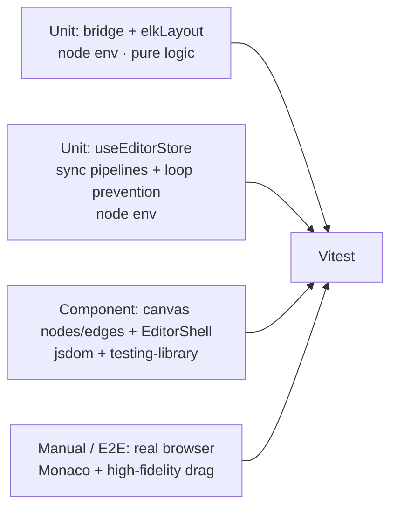

# Architecture: SCXML Visual & Code Editor

This document reflects the **current, as-built state** of the project (as opposed to the
forward-looking `README.md`, which describes the intended design). It covers the module
topology, the two-way synchronization pipelines, key state management, and — importantly —
what is and is not testable today and how the architecture positions us for automated
testing with Vitest.

---

## 1. High-Level Data Flow

The application maintains a dual-view paradigm: a statechart can be edited as SCXML text
(Monaco) or as visual graph nodes (React Flow). Both views are synchronized via a **unified
Zustand store** that acts as the single source of truth.

```
                  +-----------------------------------+
                  |       Unified Store (Zustand)     |
                  |        useEditorStore             |
                  +-----------------+-----------------+
                                    |
          +-------------------------+-------------------------+
          |                                                   |
          v                                                   v
+-------------------+                               +-------------------+
|   Monaco Editor   |                               | React Flow Canvas |
|    (Code View)    |                               |   (Visual View)   |
+---------+---------+                               +---------+---------+
          |                                                   |
          | Text Change (debounced)                           | Canvas events
          v                                                   v (drag/connect/delete)
+-----------------------------------------------------------------------+
|                        SCXML Bridge & Sync Engine                      |
|                                                                       |
|   parseSCXMLPartial()  ----------->  AST  ---------->  scxmlToFlow()  |
|        ^                                    ^                          |
|        |                                    |                          |
|   rawXml (serialize)                 flowToScxml() mutation helpers    |
+-----------------------------------------------------------------------+
```

Both views read/write the store. The bridge layer converts between the textual/AST
representation and the React Flow graph representation.

---

## 2. Directory Map (Source of Truth)

```
src/
├── App.tsx                              # App root; mounts EditorShell
├── main.tsx                             # React entry point
├── index.css                            # Tailwind entry
│
├── components/
│   ├── editor/
│   │   ├── EditorShell.tsx              # Root layout & splitter (react-resizable-panels)
│   │   ├── MonacoEditor.tsx             # Monaco wrapper (debounce, markers, range highlight)
│   │   └── Toolbar.tsx                  # Global actions (export, format, zoom, auto-layout)
│   ├── canvas/
│   │   ├── ReactFlowCanvas.tsx          # Main canvas; event -> AST mutation orchestration
│   │   ├── nodes/
│   │   │   ├── AtomicStateNode.tsx      # Atomic + final states (badges, action list)
│   │   │   ├── CompoundStateNode.tsx    # Nested/compound parent node (dashed container)
│   │   │   ├── ParallelNode.tsx         # Parallel regions (dashed container)
│   │   │   ├── InitialIndicatorNode.tsx # "●" dot linking to scxml.initial entry state
│   │   │   └── HistoryNode.tsx          # Deep/shallow history
│   │   ├── edges/
│   │   │   └── TransitionEdge.tsx       # Smooth-step path + midpoint label badge
│   │   └── controls/
│   │       ├── CanvasControls.tsx       # MiniMap, Zoom, FitView
│   │       └── NodePalette.tsx          # Drag-and-drop state creator sidebar
│
├── bridge/                              # *** The pure, highly-testable core ***
│   ├── scxmlToFlow.ts                   # AST -> React Flow nodes/edges + initial indicator;
│   │                                    #   EDGE_MARKER, action summaries
│   ├── flowToScxml.ts                   # Canvas mutation helpers -> AST (in-place)
│   ├── metadataRegistry.ts              # readLayout / writeLayout / collectStateNodes /
│   │                                    #   readTransitionId / writeTransitionId
│   └── sourceMapper.ts                  # AstNode id -> Monaco SourceRange
│
├── layout/
│   └── elkLayout.ts                     # layoutScxmlGraph (ELK layered, orthogonal routing);
│                                        #   ELK_OPTIONS export
│
└── store/
    ├── useEditorStore.ts                # Central store; pipelines + selection sync
    └── slices/
        ├── codeSlice.ts                 # rawXml, parseErrors, activeSourceRange
        ├── graphSlice.ts                # React Flow nodes/edges, selectedNodeId
        └── syncSlice.ts                 # syncOrigin (CODE/CANVAS/IDLE), isDirty
```

---

## 3. Synchronization Pipelines

All sync traffic flows through `useEditorStore`. Two pipelines exist, plus a general
AST-mutation entry point. A `syncOrigin` transaction flag prevents circular re-entry.

### 3.1 `seedStore(xml)` — initial load

1. `beginTransaction("CODE")`, set `rawXml`.
2. `parseSCXMLPartial(xml, { captureStringPositions: true })`.
3. Store `ast` + diagnostics; mark `livePreviewPaused` when `result.recoverable` is false.
4. `scxmlToFlow(ast)` → nodes/edges.
5. If any node lacks persisted coordinates (`needsAutoLayout`), kick off an async
   `layoutScxmlGraph` pass and persist the resulting coords back into `<metadata>` via
   `applyAstMutation`.
6. `endTransaction()`.

### 3.2 `updateCodeFromUser(xml)` — CODE → AST → CANVAS

1. **Guard**: if `syncOrigin === "CANVAS"`, return early (text was pushed back from a
   canvas transaction, not typed by the user).
2. `beginTransaction("CODE")`, save `rawXml`.
3. Re-parse; store `ast`, errors, `livePreviewPaused`.
4. `scxmlToFlow(ast)` → patch React Flow `nodes`/`edges` while preserving a still-valid
   selection.
5. `endTransaction()`.

> Monaco calls this from a **200ms debounce** (`SYNTAX_DEBOUNCE_MS` in `MonacoEditor.tsx`).

### 3.3 `updateGraphFromUser(nodes, edges)` — CANVAS → AST → CODE

1. **Guard**: if `syncOrigin === "CODE"`, return early.
2. `beginTransaction("CANVAS")`, update React Flow nodes/edges.
3. Re-serialize `ast` → XML and push back into `rawXml`.
4. `endTransaction()`.

### 3.4 `applyAstMutation(mutationFn)` — general AST mutation

Used by every canvas edit (drag, connect, delete) and by the ELK layout persistence.

1. `beginTransaction("CANVAS")`.
2. `structuredClone` the AST → run `mutationFn` on the clone (keeps the source-of-truth AST
   immutable until commit).
3. `serializeSCXML` → set `ast` + `rawXml`.
4. `scxmlToFlow` → set React Flow nodes/edges.
5. `endTransaction()`.

> `structuredClone` is a deliberate choice: mutations are isolated and the existing AST is
> only replaced on commit. This is a boon for testability — callers get transactional
> semantics without global state bleed.

### 3.5 Canvas event handlers (`ReactFlowCanvas.tsx`)

- **drag stop** → `applyAstMutation(persistNodePosition(doc, id, x, y))`
- **connect** → `applyAstMutation(connectStates(doc, source, target))`
- **delete** → `applyAstMutation(deleteEdge / deleteState)`
- Local churn (`onNodesChange`, `onEdgesChange`) is applied via `applyNodeChanges` /
  `applyEdgeChanges` and is reconciled back to the AST only at gesture-commit time
  (drag-stop / connect / delete), not on every change tick.

### 3.6 Selection sync

- `selectElement(id, "CANVAS")` → sets `selectedNodeId` and calls
  `sourceToMonacoRange(ast, id)` → `setActiveSourceRange` (drives Monaco
  `revealRangeInCenterIfOutsideViewport` + `setSelection`).
- Code-side selection flows through `selectSourceRange(range)`.

---

## 4. State Store Schema

`useEditorStore` (`src/store/useEditorStore.ts`) composes three slices plus core state:

```ts
interface EditorStore extends CodeState, GraphState, SyncState {
  ast: SCXMLDocument | null;
  setAst(ast): void;
  seedStore(xml: string): void;
  updateCodeFromUser(xml: string): void;
  updateGraphFromUser(nodes: Node[], edges: Edge[]): void;
  applyAstMutation(fn: (ast: SCXMLDocument) => void): void;
  selectElement(id: string | null, source: "CODE" | "CANVAS"): void;
  selectSourceRange(range: SourceRange | null): void;
}
```

| Slice        | State                                                             | Key actions                                |
| ------------ | ----------------------------------------------------------------- | ------------------------------------------ |
| `codeSlice`  | `rawXml`, `parseErrors`, `livePreviewPaused`, `activeSourceRange` | `setRawXml`, `setParseErrors`, ...         |
| `graphSlice` | `nodes`, `edges`, `selectedNodeId`                                | `setNodes`, `setEdges`, `setNodesAndEdges` |
| `syncSlice`  | `syncOrigin ("CODE"\|"CANVAS"\|"IDLE")`, `isDirty`                | `beginTransaction`, `endTransaction`, ...  |

`scxml-parser` (a GitHub dependency, `github:PranayPant/scxml-parser#refs/pull/2/head`)
provides `parseSCXMLPartial`, `serializeSCXML`, and mutation helpers (`addState`,
`addTransition`, `removeState`, `removeTransition`, `renameState`).

---

## 5. Key Design Invariants

1. **Single source of truth = the SCXML AST.** Both views are derived projections; neither
   view stores authoritative structure.
2. **Persistent node IDs** = SCXML `id` attributes; transition edge IDs =
   `source:target_index` (deterministic, via `transitionEdgeId`).
3. **Coordinate persistence** lives in `<metadata><ui:layout x y width height/></metadata>`
   (`metadataRegistry.ts`). Existings coords are honored; missing coords trigger one ELK
   pass and are written back.
4. **Transaction semantics** via `syncOrigin` + `structuredClone` guard against circular
   update loops and torn writes.
5. **`captureStringPositions: true`** is required for `sourceToMonacoRange` to map node ids
   back to source ranges.
6. **Initial-state indicator is a derived pseudo-node.** `scxmlToFlow` synthesizes a
   `__initial__` node (React Flow type `initialIndicator`) plus a `__initial__:0` edge
   pointing at `scxml.initial`. It is **not** a real AST state: it positions itself up-left
   of its target, never auto-layouts, and is guarded from `handleDelete` in the canvas.
   Reserved ids use the `__` prefix so real state ids can never collide.
7. **Action summaries are a projection.** `onentry`/`onexit` executable content is collapsed
   (`summarizeExecutables`) into short strings for node action lists; the source of truth
   remains the AST, so this is read-only display data.
8. **No anti-defensive branches against parser internals.** `determineKind` no longer carries
   an unreachable `parallel` return (every `ParallelNode` in this parser's AST has a `states`
   field, so nested parallels classify as `compound`). `connectStates` records the transition
   `id` as assigned by `addTransition` directly — the previous `findTransitionIndex`/
   `collectTransitionOwners` helpers were dead (the parser always sets `t.id`, so the lookup
   never ran) and were removed rather than left as phantom coverage gaps. The bridge suite
   enforces 100% function coverage and a ~99% line floor on genuinely reachable logic.

### 5.1 Canvas visualization layer

The visual layer follows Stately.ai-style conventions (see `ENHANCEMENTS.md`):

- **Edge rendering** (`TransitionEdge.tsx`): uses `getSmoothStepPath` (orthogonal,
  `borderRadius: 8`) instead of bezier curves, and `EdgeLabelRenderer` to pin an
  absolutely-positioned inline-flex badge to the path midpoint. Event renders in blue,
  condition in amber. For reciprocal transitions (e.g. `idle` ⇄ `running`) the label of
  **one** direction of the pair is offset by `-14px` on the perpendicular axis (chosen
  deterministically by lexicographic source order in `scxmlToFlow`), so the two labels
  separate instead of colliding at the shared path midpoint.
- **Edge markers** (`scxmlToFlow.ts` `EDGE_MARKER`): every transition edge carries an
  `ArrowClosed` marker (16×16, `#64748b`) so direction reads clearly at low zoom.
- **Orthogonal ELK routing** (`elkLayout.ts` `ELK_OPTIONS`): `elk.edgeRouting:
"ORTHOGONAL"`, `BRANDES_KOEPF` node placement, generous node/layer spacing, and port
  clearance (`elk.layered.mergeEdges: false`, `elk.spacing.portPort: 20`). Pseudo-nodes
  (`__`-prefixed) and their edges are excluded from layout so they never distort routing or
  receive their own slot.
- **Coordinate contract** (`scxmlToFlow.ts` `normalizeNodesForReactFlow`): the SCXML AST
  stores **global** coordinates; React Flow expects a child's `position` to be **relative**
  to its parent. `normalizeNodesForReactFlow` gives every node a fallback dimension (for
  DOM-less layout/testing), **re-derives a compound parent's global position + bounding
  box from the union of its children** (+40px padding) so the container always wraps its
  sub-states, then converts children to relative coords. This parent-position derivation
  is what keeps nested states visually inside their container even when persisted child
  coords fall outside the parent's stored position. `elkLayout.ts` emits relative child
  coords + parent dimensions, and `flowToScxml.ts` `persistNodePosition` converts drag
  positions back to **global** before writing to `<metadata>`.
- **State cards**: text badges are removed in favor of border tokens — atomic = solid slate
  card, compound = dashed indigo container, parallel = dotted cyan container, final = red
  ring with a bullseye icon card. All state nodes show optional `entry`/`exit` action lists
  and render type-appropriate title colors. Native history nodes are unchanged.
- **Theming**: a semantic dark token system (Tailwind `node.*`/`edge.*` palette + CSS vars
  `--canvas-bg`, `--xy-edge-stroke-*`) unifies canvas + Monaco. `MonacoEditor` defines and
  applies a `scxml-dark` theme (zinc-950 bg, functional tag/attribute/string colors).

---

## 6. Testing Capabilities

### 6.1 Current state

**Vitest is wired up and running** (Node by default, jsdom per-file for components):

- `package.json` has `test` / `test:watch` / `test:coverage` scripts
  (`vitest run` / `vitest` / `vitest run --coverage`).
- **Vitest 3.2.x** + **`@vitest/coverage-v8@^3`** (matching) are dev dependencies,
  compatible with Vite 5.
- `vite.config.ts` contains a `test` block (`environment: "node"`, `globals: true`,
  `include: ["src/**/*.{test,spec}.{ts,tsx}"]`, v8 coverage with per-directory
  thresholds).
- **Current suite (50 tests across 9 files):**
  - `src/bridge/scxmlToFlow.test.ts` — AST→graph kinds, `__initial__` synthesis,
    coordinate normalization/bounds, dynamic handles, subflow boundary routing,
    action summaries.
  - `src/bridge/flowToScxml.test.ts` + `flowToScxml.error.test.ts` — mutation
    isolation, coordinate write-back, error-handling contract for `addStateNode`.
  - `src/bridge/metadataRegistry.test.ts` — layout/transitionId read/write, traversal.
  - `src/bridge/sourceMapper.test.ts` — id→range mapping.
  - `src/bridge/sampleDocument.test.ts` — starter-document fixture sanity.
  - `src/layout/__tests__/elkLayout.test.ts` — ELK containment, relative emission,
    parent dimensions.
  - `src/store/__tests__/useEditorStore.test.ts` — sync-origin loop prevention,
    transactional `applyAstMutation`, seed/parse, slice setters.
  - `src/components/canvas/__tests__/StateNodeWrapper.test.tsx` (jsdom) — all 8
    namespaced handles mount on every node kind (error #008 guard).

Run with `npm test`. Coverage passes with **no threshold errors**: `store/slices` 100%,
`bridge` ≈ 99% lines / 100% functions, global `All files` ≈ 91%.

### 6.2 Why the architecture is well-suited to Vitest

The decisive property: **the synchronization logic is mostly pure and the store is
DOM-independent.** Zustand stores can be instantiated and driven in plain Node (no React,
no browser), and the bridge functions take an AST/document and return or mutate plain data.

| Layer                                | Test env                | How to test                                                                                                                        |
| ------------------------------------ | ----------------------- | ---------------------------------------------------------------------------------------------------------------------------------- |
| `bridge/scxmlToFlow.ts`              | `node`                  | Feed an `SCXMLDocument`; assert `nodes`/`edges`/`needsAutoLayout`, edge IDs, `__initial__` indicator + its edge, action summaries. |
| `bridge/flowToScxml.ts`              | `node`                  | Call `connectStates`/`deleteState`/`renameStateId`/`persistNodePosition`; serialize & assert XML round-trip.                       |
| `bridge/metadataRegistry.ts`         | `node`                  | `readLayout`/`writeLayout`/`collectStateNodes`.                                                                                    |
| `bridge/sourceMapper.ts`             | `node`                  | `sourceToMonacoRange(doc, id)` → `SourceRange`. Pure.                                                                              |
| `layout/elkLayout.ts`                | `node` (may mock)       | Deterministic async; works in Node. Optional `vi.mock("elkjs")` stub for speed/CI stability; one real integration test.            |
| `store/useEditorStore.ts`            | `node`                  | Drive `seedStore`/`updateCodeFromUser`/`applyAstMutation` directly; assert `ast`, `rawXml`, `nodes`, `edges`.                      |
| `components/canvas/*`                | `jsdom`                 | `@testing-library/react` + `@testing-library/user-event` to simulate drag/connect/delete; wrap in `ReactFlowProvider`.             |
| `components/editor/EditorShell.tsx`  | `jsdom`                 | Mock `MonacoEditor` + `ReactFlowCanvas`; test panel collapse/reset/maximize.                                                       |
| `components/editor/MonacoEditor.tsx` | `jsdom` + mocked Monaco | `vi.mock("@monaco-editor/react")`; verify debounced `updateCodeFromUser` with fake timers.                                         |

**Highest-value, lowest-friction targets (pure, Node-only):**

- `scxmlToFlow` — deterministic AST → graph conversion (including the derived
  `__initial__` indicator node/edge and action summaries).
- `flowToScxml` — mutation helpers + serialization round-trip.
- `sourceMapper` — id → range mapping.
- `useEditorStore` — the sync pipelines **and**, critically, the **circular sync
  prevention protocol**: call `beginTransaction("CANVAS")` then `updateCodeFromUser` and
  assert it short-circuits; assert `syncOrigin` returns to `IDLE` after `endTransaction`.

### 6.3 Friction points (need mocking or a real browser)

- **Monaco**: requires heavy ESM workers + real browser surfaces. Mock
  `@monaco-editor/react` for anything above the store.
- **React Flow gestures**: drag/connect/delete are DOM/interaction-driven. Simulate with
  `user-event`; the underlying _logic_ (in `flowToScxml.ts`) is already pure and testable
  without the DOM.
- **`elkjs` bundled worker**: works in Node but can be slow/flaky in CI; mock for fast
  store tests.
- **`structuredClone`**: requires Node ≥ 17+ (or modern browser). Fine for Vitest's Node
  environment.

### 6.4 Recommendation — test pyramid



The store + bridge layers carry the bulk of coverage; component tests cover interaction
wiring; only true Monaco mounting and pixel-fidelity drag gestures are left to manual
verification.

**Coverage gate (instrumented, not gamed):** `vite.config.ts` enforces per-directory
thresholds — `store/slices` is strict **100%** (pure set/get contracts), `bridge` sits at
a high floor (90%+ lines/functions/statements), and the global baseline is 80%. The suite
deliberately does **not** chase literal 100% on `bridge`'s defensive branches that reflect
`scxml-parser` internals; those have been **removed as dead code** rather than mocked, so
the reported ~99% reflects genuinely reachable logic.

---

## 7. Dependencies

| Package                                | Role                                      |
| -------------------------------------- | ----------------------------------------- |
| `@monaco-editor/react`                 | Monaco code editor wrapper                |
| `monaco-editor`                        | Monaco core                               |
| `@xyflow/react` (v12)                  | React Flow canvas                         |
| `react-resizable-panels`               | Split-pane editor shell                   |
| `scxml-parser` (GitHub `#main`)        | SCXML parse/serialize/mutation            |
| `elkjs`                                | Auto-layout (layered, orthogonal)         |
| `zustand`                              | Store                                     |
| `react` / `react-dom`                  | UI                                        |
| `vite` + `@vitejs/plugin-react`        | Build/dev (TS + React)                    |
| `typescript@^7.0.2`                    | Type checking (`tsc --noEmit`)            |
| `tailwindcss` + `postcss`              | Styling                                   |
| `vitest` (dev)                         | Test runner (Node env, via `test` script) |
| `@vitest/coverage-v8` (dev)            | V8 coverage (per-directory thresholds)    |
| `@testing-library/react`+`jsdom` (dev) | Component tests in `jsdom` env            |
